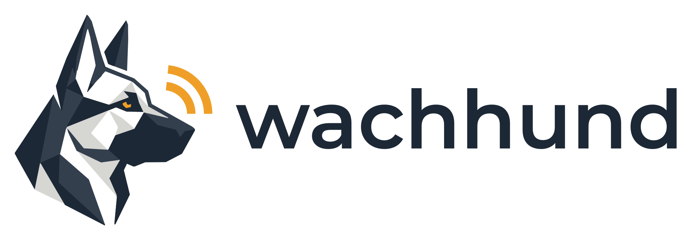

  <picture>
    <source media="(prefers-color-scheme: dark)" srcset=".github/assets/wachhund-banner-dark.svg">
    
  </picture>

Sigma detection-as-code for Elastic and Kusto.

**wachhund** (German for *watchdog*) is a detection-as-code repo. Sigma rules are
the single source of truth. Platform queries are build artifacts: CI converts every
rule on each pull request and never commits the output.

## Targets

| Platform | Support |
| --- | --- |
| Elastic Security | Primary. Rules are validated on it in hauslab, the maintainer's lab |
| Kusto (Defender XDR advanced hunting, Microsoft Sentinel) | Primary |
| Splunk | Best-effort |

## Layout

| Path | Contents |
| --- | --- |
| `rules/` | Sigma rules, in SigmaHQ's folder layout |
| `regression_data/` | True-positive and benign test events for each rule |
| `pipelines/` | Conversion targets and field mappings for each platform |
| `tests/` | The checks CI runs, including conversion and regression tests |

## How a rule gets here

Every rule follows SigmaHQ's conventions and is paired with an Atomic Red Team test
plus true-positive and benign sample events. [CONVENTIONS.md](CONVENTIONS.md) sets
out what a rule must contain. [WORKFLOW.md](WORKFLOW.md) covers the path from branch
to pull request to hauslab, and [TESTING.md](TESTING.md) is the checklist for testing
a rule, both automatically and live in hauslab.

Rules start at `status: experimental`. A rule moves to `test` only after the
maintainer has run its atomic in hauslab and seen it fire.

To run the same checks as CI, see
[CONVENTIONS.md, section 9](CONVENTIONS.md#9-tests-and-ci).
