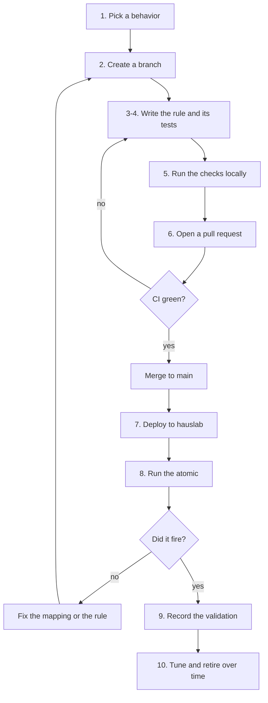

# Detection Workflow

How a detection goes from an idea to a rule that's validated in hauslab. This file
covers the order of work. What a rule must look like is in
[CONVENTIONS.md](CONVENTIONS.md).



## 1. Pick a behavior

- Start from an ATT&CK technique, a threat report, or a gap in hauslab's coverage.
- Search [SigmaHQ](https://github.com/SigmaHQ/sigma) first. If a rule already
  exists, adapt it instead of writing a duplicate, and keep its attribution
  ([CONVENTIONS.md, section 8](CONVENTIONS.md#8-rules-derived-from-sigmahq)).
- Find the [Atomic Red Team](https://github.com/redcanaryco/atomic-red-team) test
  that produces the behavior. Every rule needs one. If none exists, decide with the
  maintainer before writing the rule.

## 2. Create a branch

One rule and its tests per branch. Changes to tooling or docs get their own branch.

```text
git switch main
git pull
git switch -c rule/<rule file name without .yml>
```

## 3. Write the rule

- Folder, file name and field order follow CONVENTIONS.md, sections 1 to 3.
- Start at `status: experimental` with a fresh id:
  `python -c "import uuid; print(uuid.uuid4())"`.
- Use current ATT&CK tags (v19) and add the `simulation` entry for the atomic.

## 4. Write the tests

- Create `regression_data/<rule path without .yml>/` with `info.yml`, the
  true-positive events (`<rule id>.jsonl`) and the benign events
  (`<rule id>_benign.jsonl`). The format is in CONVENTIONS.md, section 4, under
  `regression_tests_path`.
- Synthetic events use Sigma field names and hauslab.local values only.
- Make the benign events near misses: the same tool doing something legitimate, or
  the same parent starting a harmless child. They stop later edits from making the
  rule noisier without anyone noticing.

## 5. Run the checks locally

CI runs the same steps (CONVENTIONS.md, section 9). While writing, this is the quick
loop:

```text
python tests/check_rules.py
python tests/regression_tests_runner.py <path to the rule>
python tests/convert_rules.py <path to the rule>
```

If conversion flags an unmapped field, add a mapping in `pipelines/`. Never rename
the field in the rule.

## 6. Open a pull request

```text
git add rules regression_data          # plus pipelines if you added a mapping
git commit -m "Add rule: <rule title>"
git push -u origin rule/<rule file name without .yml>
```

GitHub prints a link for opening the pull request. In the description, say what the
rule detects, which atomic it was written against, the false positives you expect,
and any field that needed a pipeline mapping. CI runs on the pull request. Merge it
once CI is green, using **Squash and merge** so `main` gets one commit per change.

## 7. Deploy to hauslab

Deployment is manual for now. Take the converted queries from the CI run (open the
run under **Actions** and download the `platform-queries` artifact), or run
`python tests/convert_rules.py` locally, which writes them to `build/`.

| Platform | File | How to deploy |
| --- | --- | --- |
| Elastic (hauslab) | `elastic/<rule>.ndjson` | Kibana → Security → Rules → Detection rules (SIEM) → Import rules. The rule arrives enabled and searches Kibana's default index patterns |
| Microsoft Sentinel | `kusto/<rule>.kql` | Create a scheduled analytics rule and paste the query. Queries on Defender XDR tables need the Defender XDR connector to stream those tables |
| Defender XDR | `kusto/<rule>.kql` | Advanced hunting → run the query → Create detection rule |
| Splunk (best-effort) | `splunk/<rule>.spl` | Put your index and sourcetype in front of the query, run it, then Save As → Alert |

Menu names change between product versions; the steps stay the same.

## 8. Validate in hauslab

Only the maintainer does this step and decides whether a rule fired.

1. On a hauslab test host, run the atomic from the rule's `simulation` entry with
   Invoke-AtomicRedTeam:

   ```text
   Invoke-AtomicTest <technique> -TestGuids <atomic_guid> -GetPrereqs
   Invoke-AtomicTest <technique> -TestGuids <atomic_guid>
   Invoke-AtomicTest <technique> -TestGuids <atomic_guid> -Cleanup
   ```

2. Check that the Elastic rule raised an alert.
3. If it didn't, open the source event in Discover and compare its index and field
   names with the rule's query. A field-name mismatch is fixed in
   `pipelines/elastic.yml`; a gap in the logic is fixed in the rule. Either way,
   start again from step 2 on a new branch.

## 9. Record the validation

Do this only after the maintainer confirms the rule fired. Use a new branch, for
example `rule/<name>-validated`.

1. In Discover, open the event that triggered the alert, copy its JSON and sanitize
   it ([CONVENTIONS.md, section 7](CONVENTIONS.md#7-public-repo-hygiene)). Save it as
   `capture.json`, then write it as one line next to `info.yml`:

   ```text
   python -c "import json; e = json.load(open('capture.json', encoding='utf-8')); open('<rule id>_hauslab.jsonl', 'w', encoding='utf-8', newline='\n').write(json.dumps(e) + '\n')"
   ```

2. In `info.yml`, add a test for that file with `type: jsonl`, `match_count: 1` and
   `pipelines: [pipelines/elastic.yml, ecs_windows]`, and add a `validated` entry
   with `platform: elastic` and the date.
3. Set the rule's `status: test`, then commit (`Validate rule: <rule title>`) and
   open a pull request as in step 6. CI checks the status gate and runs the capture
   through the same Elastic mapping that conversion uses.

## 10. Tune and retire

- **False positives:** if the exclusion holds anywhere (default OS behavior, common
  software), add a `filter_main_*` or `filter_optional_*` to the rule, plus a benign
  event that reproduces the false positive so the fix stays tested. Exclusions for a
  particular environment never go in this repo.
- **Logic changes to a validated rule:** the old validation doesn't cover the new
  logic. Set `modified`, re-run the atomic in hauslab, and update the `validated`
  date before merging.
- **Retiring a rule:** set `status: deprecated` and `modified`, add a `related` link
  to any replacement, move the file to `deprecated/`, and remove the rule from the
  platforms.

## Who does what

- **Anyone, Claude included:** draft rules, tests and pipeline mappings, run the
  checks, push branches, and open pull requests.
- **Maintainer only:** merge to `main`, deploy to hauslab, run the atomics, and
  confirm that a rule fired. A `validated` entry or a `test` or `stable` status is
  recorded only after that confirmation.

## One-time GitHub setup

To have GitHub enforce this flow, protect `main` under **Settings → Rules →
Rulesets → New branch ruleset**:

- Set **Enforcement status** to **Active**; until then the ruleset does nothing.
- Target the default branch.
- Turn on **Require a pull request before merging** and set required approvals to
  0, so you can merge your own pull requests.
- Turn on **Require status checks to pass** and add the `validate` check.
- Keep **Block force pushes** on.
